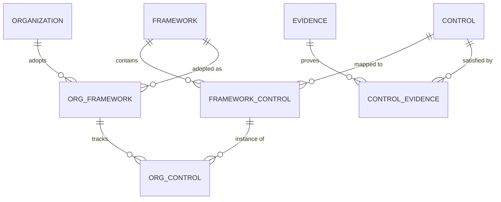

# Phase 1: RMF Framework Design Document

> **Goal:** Design a config-driven Risk Management Framework (RMF) engine that supports SOC 2, PCI DSS, ISO 27001, and future frameworks with minimal code changes.

---

## 1. Domain Model

### 1.1 Core Entities



### 1.2 Entity Definitions

| Entity | Description | Source |
|--------|-------------|--------|
| **Framework** | A compliance standard + version (SOC 2 v2024, PCI DSS v4.0) | Seed Migration |
| **Control** | A reusable security requirement (can map to multiple frameworks) | Seed Migration |
| **FrameworkControl** | Junction table linking controls to frameworks | Seed Migration |
| **Evidence** | Proof artifact that a control is implemented | Runtime (User) |
| **ControlEvidence** | Junction table linking evidence to controls | Runtime (User) |
| **Organization** | A company using the system | Runtime (User) |
| **OrgFramework** | A framework adopted by an organization | Runtime (User) |
| **OrgControl** | Organization's instance of a control with status | Runtime (User) |

### 1.3 Configuration vs Code Separation

| Layer | Examples | Mutability |
|-------|----------|------------|
| **Seed Data (Read-Only)** | Frameworks, Controls, Control-Framework mappings | Applied via Alembic migrations, version-controlled |
| **Runtime (User Data)** | Organizations, Adopted frameworks, Evidence, Status | User-editable via API |
| **Code** | API endpoints, business logic, validation rules | Stable across framework changes |

### 1.4 What Changes vs What Stays Stable

| Stable | Changes |
|--------|---------|
| Database schema | Framework definitions (via seed migrations) |
| API endpoints | Control mappings (via seed migrations) |
| Core business logic | User data (evidence, status) |

---

## 2. Logical Database Schema (PostgreSQL)

### 2.1 Database Schemas (Namespaces)

The database uses three schemas for logical separation:

| Schema | Purpose | Tables |
|--------|---------|--------|
| `lookup` | Seed/reference data | frameworks, controls, framework_controls |
| `data` | User-generated data | organizations, org_frameworks, org_controls, evidence, control_evidence |
| `audit` | Future: Audit logging | (reserved for production) |

### 2.2 Core Tables

```
┌─────────────────────────────────────────────────────────────────────┐
│                   LOOKUP SCHEMA (Seed Data)                         │
├─────────────────────────────────────────────────────────────────────┤

lookup.frameworks
├── id (UUID, PK)
├── code (e.g., "soc2", "pci_dss", "iso27001")
├── version (e.g., "2024", "v4.0")
├── name
├── description
├── status (active, deprecated, draft)
├── created_at, updated_at
└── UNIQUE (code, version)

lookup.controls
├── id (UUID, PK)
├── code (unique: "encrypt_at_rest", "mfa_required")
├── title
├── description
├── category (access_control, encryption, monitoring, etc.)
├── control_type (technical, organizational, physical)
└── created_at, updated_at

lookup.framework_controls
├── id (UUID, PK)
├── framework_id (FK → frameworks)
├── control_id (FK → controls)
├── framework_control_code (e.g., "CC6.1", "Req 3.5.1")
├── is_required (boolean)
└── created_at, updated_at

┌─────────────────────────────────────────────────────────────────────┐
│                    DATA SCHEMA (Runtime)                            │
├─────────────────────────────────────────────────────────────────────┤

data.organizations
├── id (UUID, PK)
├── name
├── slug (unique)
└── created_at, updated_at

data.org_frameworks
├── id (UUID, PK)
├── organization_id (FK)
├── framework_id (FK → lookup.frameworks)
├── status (not_started, in_progress, complete)
├── adopted_at
└── created_at, updated_at

data.org_controls
├── id (UUID, PK)
├── org_framework_id (FK)
├── framework_control_id (FK)
├── status (not_started, in_progress, complete, not_applicable)
├── due_date
├── notes
└── created_at, updated_at

data.evidence
├── id (UUID, PK)
├── organization_id (FK)
├── title
├── description
├── evidence_type (screenshot, document, log_export, attestation)
├── file_url (S3 path or external URL)
├── source (manual, aws, github, jira)
├── collected_at
└── created_at, updated_at

data.control_evidence
├── id (UUID, PK)
├── org_control_id (FK)
├── evidence_id (FK)
├── linked_at
└── created_at, updated_at
```

### 2.3 How New Frameworks Are Added (No Schema Changes)

1. Create or update seed data files
2. Run `python -m migrations.seed.gen_seed_data`
3. New framework appears in the system, version-controlled in Git

### 2.4 Versioning Strategy

| Scenario | Approach |
|----------|----------|
| New framework version (PCI DSS v4.0 → v4.1) | Create new `frameworks` row with new version, re-map controls |
| Control updated | Add new control with updated description, deprecate old |
| Organization migrates versions | Create new `org_framework` row pointing to new framework+version |

---

## 3. API Surface (FastAPI)

### 3.1 Framework APIs (Read-Only)

| Method | Endpoint | Description |
|--------|----------|-------------|
| GET | `/frameworks` | List all frameworks (filter by `code`, `status`) |
| GET | `/frameworks/{id}` | Get framework details by UUID |
| GET | `/frameworks/{id}/controls` | List controls for a framework |
| GET | `/controls` | List all controls |
| GET | `/controls/{code}` | Get control details |

### 3.2 Organization APIs

| Method | Endpoint | Description |
|--------|----------|-------------|
| POST | `/organizations` | Create organization |
| GET | `/organizations/{slug}` | Get organization details |
| POST | `/organizations/{slug}/frameworks` | Adopt a framework |
| GET | `/organizations/{slug}/frameworks` | List adopted frameworks |
| GET | `/organizations/{slug}/frameworks/{id}/controls` | List org's controls |
| PATCH | `/organizations/{slug}/controls/{id}` | Update control status |

### 3.3 Evidence APIs

| Method | Endpoint | Description |
|--------|----------|-------------|
| POST | `/organizations/{slug}/evidence` | Create evidence metadata |
| GET | `/organizations/{slug}/evidence` | List all evidence |
| POST | `/organizations/{slug}/controls/{id}/evidence` | Link evidence to control |

### 3.4 Readiness APIs

| Method | Endpoint | Description |
|--------|----------|-------------|
| GET | `/organizations/{slug}/frameworks/{id}/readiness` | Get compliance readiness |

**Response Example:**
```json
{
  "framework_code": "soc2",
  "framework_version": "2024",
  "framework_name": "SOC 2 Type II",
  "total_controls": 50,
  "completed": 35,
  "in_progress": 10,
  "not_started": 5,
  "not_applicable": 0,
  "readiness_percentage": 70.0,
  "gaps": [
    { "code": "access_review", "title": "Access Reviews", "framework_control_code": "CC6.2", "status": "not_started" }
  ]
}
```

### 3.5 API Stability

The API remains stable because:
- Endpoints are **entity-based** (frameworks, controls, evidence), not framework-specific
- No `/soc2/...` or `/pci-dss/...` endpoints — all frameworks use the same routes
- Framework-specific behavior is driven by **configuration**, not code

---

## 4. Extensibility & Trade-offs

### Trade-off 1: Flat Control Library vs Hierarchical

| Option | Pros | Cons |
|--------|------|------|
| **Flat controls** (chosen) | Simpler queries, easier reuse | Loses domain/category hierarchy |
| Hierarchical domains | Mirrors framework structure | Complex joins, harder to reuse |

**Decision:** Use `category` field on controls for grouping.

---

### Trade-off 2: Seed Migrations vs YAML Config Sync

| Option | Pros | Cons |
|--------|------|------|
| **Seed migrations** (chosen) | Uses existing Alembic tooling, atomic | Less human-readable than YAML |
| YAML/JSON config files | Human-readable, easy to edit | Requires custom sync logic |

**Decision:** Frameworks/controls are seeded via Python scripts using SQLAlchemy upserts.

---

### Trade-off 3: Single Evidence Table vs Type-Specific Tables

| Option | Pros | Cons |
|--------|------|------|
| **Single table** (chosen) | Simpler queries, flexible | Less type safety |
| Separate tables | Strict schema per type | Complex joins |

**Decision:** Single `evidence` table with `evidence_type` enum and `source` for origin tracking.

---

### Trade-off 4: UUIDs vs Integer IDs

| Option | Pros | Cons |
|--------|------|------|
| **UUIDs** (chosen) | No central ID authority, safe for distributed systems | Slightly larger, less readable |
| Integer IDs | Smaller, sequential | Requires coordination, predictable |

**Decision:** UUIDs for all primary keys for future multi-tenancy and API security.

---

## 5. MVP vs Production Roadmap

### 5.1 Current MVP Implementation

| Feature | Status | Notes |
|---------|--------|-------|
| Framework CRUD (read) | ✅ Implemented | Seed data via migrations |
| Control library | ✅ Implemented | Reusable across frameworks |
| Organization management | ✅ Implemented | Create, adopt frameworks |
| Control status tracking | ✅ Implemented | Update status per control |
| Evidence metadata | ✅ Implemented | Manual upload only |
| Readiness calculation | ✅ Implemented | Percentage + gaps |
| API documentation | ✅ Implemented | Swagger/OpenAPI |
| Docker deployment | ✅ Implemented | docker-compose |
| CI/CD pipeline | ✅ Implemented | GitHub Actions |

### 5.2 Production Enhancements

| Feature | Priority | Description |
|---------|----------|-------------|
| **Authentication & Authorization** | High | JWT/OAuth2, RBAC per organization |
| **Multi-tenancy** | High | Tenant isolation via org_id filtering |
| **Audit logging** | High | Track all changes in `audit` schema |
| **File storage** | Medium | S3 integration for evidence files |
| **Automated evidence collection** | Medium | AWS, GitHub, Jira integrations |
| **Notifications** | Low | Email/Slack alerts for due dates |
| **Reporting** | Low | PDF/Excel export of compliance status |

---

## 6. Extensibility: Automated Evidence Collection

### 6.1 Architecture Overview

```
┌─────────────────┐     ┌─────────────────┐     ┌─────────────────┐
│   FastAPI       │────▶│   RabbitMQ/SQS  │────▶│   Worker        │
│   (Producer)    │     │   (Queue)       │     │   (Consumer)    │
└─────────────────┘     └─────────────────┘     └─────────────────┘
                                                        │
                        ┌───────────────────────────────┼───────────────────────────────┐
                        │                               │                               │
                        ▼                               ▼                               ▼
                ┌───────────────┐              ┌───────────────┐              ┌───────────────┐
                │  AWS Collector │              │ GitHub Collector│            │ Jira Collector │
                │  - CloudTrail  │              │  - Audit logs   │            │  - Tickets     │
                │  - Config      │              │  - Branch rules │            │  - Attachments │
                │  - IAM         │              │  - Dependabot   │            │                │
                └───────────────┘              └───────────────┘              └───────────────┘
```

### 6.2 Integration Points

| Service | Evidence Type | Controls Satisfied |
|---------|--------------|-------------------|
| **AWS CloudTrail** | Log exports | Logging, monitoring controls |
| **AWS Config** | Configuration snapshots | Encryption, network controls |
| **AWS IAM** | Access reports | Access control, MFA |
| **GitHub** | Audit logs, branch protection | Change management, code review |
| **Jira** | Ticket history, attachments | Incident response, remediation |
| **Okta/Auth0** | Access logs, MFA status | Identity, authentication |

### 6.3 Worker Implementation (Future)

```python
# workers/evidence_collector.py
import pika  # or boto3 for SQS

class EvidenceCollectorWorker:
    """Background worker for automated evidence collection."""
    
    def __init__(self, queue_url: str):
        self.queue_url = queue_url
        self.collectors = {
            "aws": AWSCollector(),
            "github": GitHubCollector(),
            "jira": JiraCollector(),
        }
    
    async def process_message(self, message: dict):
        """Process a collection request from the queue."""
        org_id = message["organization_id"]
        source = message["source"]
        control_id = message["control_id"]
        
        collector = self.collectors[source]
        evidence = await collector.collect(org_id, control_id)
        
        # Save evidence to database
        await self.save_evidence(evidence)
        
        # Link to control
        await self.link_to_control(evidence.id, control_id)
```

### 6.4 Queue Message Format

```json
{
  "message_type": "collect_evidence",
  "organization_id": "uuid",
  "source": "aws",
  "control_id": "uuid",
  "parameters": {
    "service": "cloudtrail",
    "region": "us-east-1",
    "date_range": "last_30_days"
  },
  "scheduled_at": "2024-02-01T00:00:00Z"
}
```

### 6.5 Scheduling Options

| Option | Use Case |
|--------|----------|
| **On-demand** | User triggers collection via API |
| **Scheduled** | Cron-based daily/weekly collection |
| **Event-driven** | Webhook from AWS/GitHub triggers collection |

---

## 7. Authentication & Multi-tenancy (Production)

### 7.1 Authentication Strategy

| Option | Recommendation |
|--------|----------------|
| **JWT tokens** | Short-lived access tokens, refresh tokens |
| **OAuth2 providers** | Google, GitHub, Okta via Auth0/Clerk |
| **API keys** | For service-to-service communication |

### 7.2 Multi-tenancy Approach

```python
# Tenant isolation via middleware
class TenantMiddleware:
    async def __call__(self, request: Request, call_next):
        # Extract org_id from JWT token
        org_id = request.state.user.organization_id
        
        # Inject into database session
        request.state.db.execute(
            text(f"SET app.current_org_id = '{org_id}'")
        )
        
        return await call_next(request)

# Row-level security in PostgreSQL
# CREATE POLICY org_isolation ON data.evidence
#   USING (organization_id = current_setting('app.current_org_id')::uuid);
```

### 7.3 RBAC Roles

| Role | Permissions |
|------|-------------|
| **Admin** | Full access, manage users, adopt frameworks |
| **Compliance Manager** | Update controls, upload evidence, view reports |
| **Auditor** | Read-only access to all data |
| **Viewer** | Read-only access to assigned controls |

---

## 8. Verification Plan

### Automated Tests
```bash
# Run all tests
pytest tests/ -v

# Test specific endpoints
pytest tests/test_frameworks.py -v
```

### Manual Verification
1. Start the app: `docker-compose up`
2. Run migrations: `docker-compose exec app alembic upgrade head`
3. Seed data: `docker-compose exec app python -m migrations.seed.gen_seed_data`
4. Create an org and adopt a framework via API
5. Check readiness endpoint

---

## 9. Summary

This design provides a **config-driven, extensible RMF engine** that:

1. **Supports multiple frameworks** without code changes
2. **Separates seed data from runtime data** for auditability
3. **Uses entity-based APIs** that remain stable as frameworks evolve
4. **Is designed for production extensibility** with clear paths for:
   - Authentication & RBAC
   - Multi-tenancy
   - Automated evidence collection
   - Background processing via message queues

The MVP demonstrates core functionality while the architecture supports future growth.
